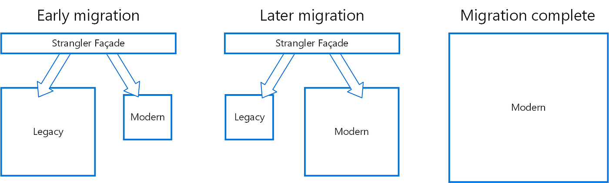

# Strangler Fig Pattern

A partir de la evolución de las arquitecturas, y especialmente con la llegada de los microservicios muchas aplicaciones
inician un proceso de migración; el tamaño de los monolitos hace que ese proceso sea lento y gradual, surgiendo la
necesidad de lograr una convivencia entre el viejo sistema y los nuevos servicios que se van creando paulatinamente.

Para lograr que el sistema legado funcione y cada uno de los microservicios que se van creando realice su tarea
particular es necesario definir un mecanismo que sirva de fachada para las aplicaciones clientes y dirija el tráfico de
las operaciones al ente correspondiente.

El patrón Strangler Fig propone la migración gradual de un sistema legada. En lugar de reescribir la aplicación completa
de una sola vez, se van creando nuevos componentes que implementan la funcionalidad de forma incremental. Con el tiempo,
la nueva solución “estrangula” al sistema viejo, hasta que éste pueda ser eliminado sin afectar al negocio.

La creación de este mecanismo puede incluir traducción de semántica y protocolos, por ejemplo, traducir una llamada SOAP
a REST / gRPC / Cola de mensajes / u otros, para encaminarla a los servicios modernos.

La fachada que se crea implementa una capa transparente para los clientes, traduciendo las llamadas al servicio
adecuado; a medida que se van creando nuevos servicios disminuye el flujo hacia la aplicación legada. Los nuevos
microservicios van creciendo en uso “estrangulando” la aplicación legada. Esto se conoce como el Patrón Strangler (en la
traducción al español se conoce como de estrangulación).

La forma en que se estrangula el sistema legado requiere tener en cuenta ciertas consideraciones en el proceso de
transición:

1. Debe existir consistencia en los sistemas de persistencia que emplea el sistema legado y los microservicios.

2. El desarrollo de los nuevos microservicios no puede / debe estar atado a la semántica del sistema legado, la capa de
   fachada se encargará de realizar los cambios semánticos / protocolos necesarios.

3. El equipo que desarrolla la capa de fachada debe estar al tanto de los contratos que exponen los nuevos
   microservicios, el desarrollo debe ser a la par.

4. En dependencia del tamaño del sistema legado, y el grado de descomposición de los nuevos microservicios debe velarse
   porque la fachada no se convierta en un cuello de botella para la migración, debe velarse por su escalabilidad, alta
   disponibilidad y monitorización continua.